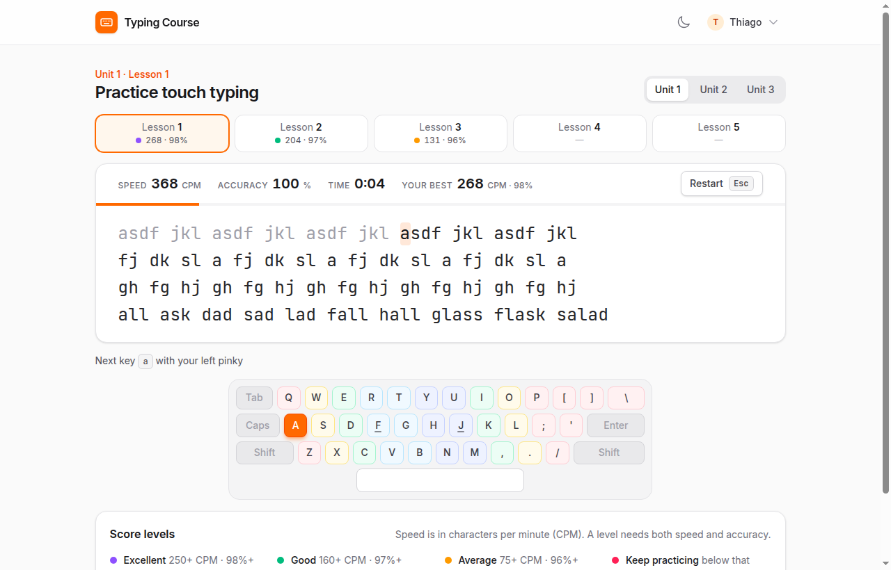
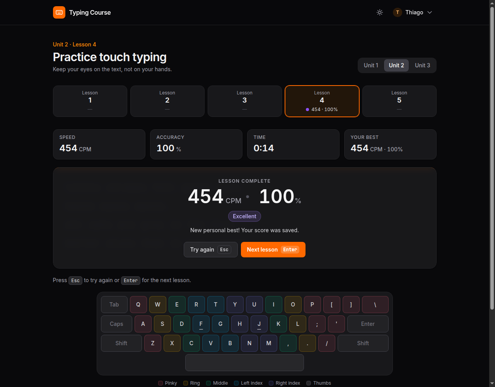

# Typing Course

タッチタイピングを練習できる Web アプリです。<br>
A web app to practice touch typing.

**https://digitacao.thiagotanaka.dev/**

[日本語](#日本語) · [English](#english)

<p>
  
  
</p>

## 日本語

### 概要

- 3 つのユニットに各 5 レッスン。ホームポジションから単語・文章まで段階的に練習できます。
- 入力速度（1 分あたりの正しい文字数、CPM）、正確さ、時間、自己ベストをリアルタイムで表示します。
- 画面上のキーボードに、指ごとの担当エリアと手を表示します。手が止まったときやミスしたときだけ次のキーと使う指を案内するので、一定のリズムで打っている間は視線をテキストに置いたままにできます。
- レッスンが終わると結果とレベルを表示し、ページを再読み込みせずにスコアを保存します。
- ログインせずに終えたレッスンの結果も、そのあとログインまたはユーザー登録をすると保存されます。
- ダークモードに対応しています（OS の設定に追従し、ヘッダーから切り替えも可能）。
- 管理者は画面からレッスンの文章を編集できます。

### 移行前と移行後

2021 年に Laravel 8 で作ったアプリを、Laravel 13 まで段階的にアップグレードし、フロントエンドも刷新しました。

| | 移行前 | 移行後 |
|---|---|---|
| PHP | 8.2 | 8.4（8.3 以上） |
| Laravel | 8.83 | 13.31 |
| フロントエンド | Vue 2 + Vuetify 2 + Bootstrap 4 + jQuery | Vue 3 + Tailwind CSS 4 |
| ビルド | laravel-mix（ビルド済みファイルを Git で管理） | Vite 8 |
| 配信する JS / CSS | 1.1 MB / 680 kB | 83 kB / 42 kB |
| テスト | サンプルのみ（PHPUnit 9） | 37 件（PHPUnit 12） |
| 既知の脆弱性（`composer audit`） | あり | なし |

### バージョンアップの進め方

1. **現在の動作を先にテストで固定** — アップグレード前の Laravel 8 上で、レッスン画面、スコア保存のルール、ユーザー登録とメール認証、管理画面の動作を確認する特性テスト（characterization test）を書きました。
2. **1 バージョンずつ更新** — 8 → 9 → 10 → 11 → 12 → 13 を 1 ステップ 1 コミットにして、毎回すべてのテストが通ることを確認しました。
3. **公式アップグレードガイドを項目ごとに確認** — 対応した変更と、このアプリに該当しなかった項目を各コミットメッセージに記録しています。
4. **既存の構成を維持** — ガイドの推奨どおり、Laravel 11 以降の新しいディレクトリ構成には移行せず、HTTP カーネルやサービスプロバイダーはそのままにしています。
5. **実際のブラウザで確認** — Laravel 13 の新しい CSRF 保護（`PreventRequestForgery`）が関わるログイン、スコア保存、管理画面での保存、ログアウトをブラウザで確認しました。

途中で見つかった問題は、アップグレードとは別のコミットで修正しています。例: Symfony Mailer への移行後、`MAIL_FROM_ADDRESS` が未設定だとユーザー登録時のメール送信が 500 エラーになる問題。

| コミット | 内容 |
|---|---|
| [`83b6d7d`](https://github.com/thiago-tanaka/typing/commit/83b6d7d) | 特性テスト（アップグレード前） |
| [`a3e53f9`](https://github.com/thiago-tanaka/typing/commit/a3e53f9) | Laravel 9（SwiftMailer → Symfony Mailer、TrustProxies と CORS をフレームワーク標準に） |
| [`569c900`](https://github.com/thiago-tanaka/typing/commit/569c900) | Laravel 10（PHPUnit 10） |
| [`10824ba`](https://github.com/thiago-tanaka/typing/commit/10824ba) | Laravel 11（PHPUnit 11、既存の構成を維持） |
| [`666868b`](https://github.com/thiago-tanaka/typing/commit/666868b) | Laravel 12 |
| [`21d9702`](https://github.com/thiago-tanaka/typing/commit/21d9702) | Laravel 13（PHP 8.3 以上、CSRF ミドルウェアの新しい名前） |

### フロントエンドの刷新

- **必要な部分だけ Vue 3** — ページは Blade のサーバーサイドレンダリングのままにして、操作が必要なレッスン画面と管理画面の編集だけを Vue 3 のコンポーネントにしました。
- **レッスン画面の使いやすさ** — 入力済み・現在・未入力の文字の区別、ミスしたキーの表示、画面上のキーボードと指の案内、終了時の結果パネル、`Esc` でやり直し・`Enter` で次のレッスン。
- **スコア保存の改善** — スコア保存を JSON API にしてバックグラウンドで保存。サーバー側で値を検証し（速度 0〜2000 CPM、正確さ 0〜100%）、メール認証済みのユーザーだけが保存できます。
- **自己ベストの判定** — 「速度と正確さの両方が以上」から、「レベルが高い方、同じレベルなら正味の速度（CPM × 正確さ）が高い方」に変更しました。
- **アクセシビリティ** — スキップリンク、フォーカス表示、色だけに頼らないレベル表示、`prefers-reduced-motion` への対応。日本語入力（IME）がオンのときは、直接入力に切り替えるよう案内します。

| コミット | 内容 |
|---|---|
| [`89dfb13`](https://github.com/thiago-tanaka/typing/commit/89dfb13) | スコア保存の JSON レスポンス |
| [`e884528`](https://github.com/thiago-tanaka/typing/commit/e884528) | Vite 8 + Vue 3 + Tailwind CSS 4 でフロントエンドを刷新 |
| [`a0bae51`](https://github.com/thiago-tanaka/typing/commit/a0bae51) | スコアの検証と自己ベストの判定ルール |
| [`1f76573`](https://github.com/thiago-tanaka/typing/commit/1f76573) | 保存できなかった理由と IME の案内 |

### ローカル環境での実行

必要なもの: PHP 8.3 以上（`pdo_sqlite` 拡張）、Composer、Node.js 20.19 以上

```bash
git clone https://github.com/thiago-tanaka/typing.git
cd typing
composer install
cp .env.example .env
php artisan key:generate
touch database/database.sqlite
php artisan migrate --seed
npm ci
npm run build
php artisan serve
```

- 開発中は `npm run build` の代わりに `npm run dev` を使うと、変更がすぐに反映されます。
- `.env.example` は SQLite を使う設定で、メールは送信せずにログ（`storage/logs/laravel.log`）に出力します。
- シーダーでレッスンと管理者ユーザーが作成されます（`database/seeders/DatabaseSeeder.php`）。
- テストの実行: `php artisan test`
- デプロイ時は `composer install --no-dev` の後に `npm ci && npm run build` が必要です（ビルド結果は Git で管理していません）。
- `docker/` はアップグレード前の開発環境で、現在は更新していません。

## English

### About

- 3 units with 5 lessons each, from the home row to words and sentences.
- Live typing speed (correct characters per minute, CPM), accuracy, time and personal best.
- An on-screen keyboard with finger zones and hands. It shows the next key and the finger to use only when you pause or miss a key, so typing at a steady pace keeps your eyes on the text.
- When a lesson ends, a result panel shows the level and saves the score without reloading the page.
- A result finished before logging in is kept and saved once the user logs in or signs up.
- Dark mode that follows the system setting and can be switched from the header.
- Admins can edit the lesson texts from the browser.

### Before and after

The app was built with Laravel 8 in 2021, upgraded step by step to Laravel 13, and got a new frontend.

| | Before | After |
|---|---|---|
| PHP | 8.2 | 8.4 (8.3+) |
| Laravel | 8.83 | 13.31 |
| Frontend | Vue 2 + Vuetify 2 + Bootstrap 4 + jQuery | Vue 3 + Tailwind CSS 4 |
| Build | laravel-mix (compiled files committed to Git) | Vite 8 |
| JS / CSS served | 1.1 MB / 680 kB | 83 kB / 42 kB |
| Tests | example tests only (PHPUnit 9) | 37 tests (PHPUnit 12) |
| Known vulnerabilities (`composer audit`) | yes | none |

### How the upgrade was done

1. **Lock in the current behavior first.** Before touching the framework, characterization tests were written on Laravel 8 for the lesson pages, the score saving rules, registration with email verification, and the admin area.
2. **One version at a time.** Each step (8 → 9 → 10 → 11 → 12 → 13) is a single commit, and all tests pass after every step.
3. **Follow the official upgrade guides item by item.** Each commit message lists what changed and which items did not apply to this app.
4. **Keep the existing structure.** As the guide recommends, the app keeps its HTTP kernel and service providers instead of moving to the slim application structure of Laravel 11.
5. **Check in a real browser.** Login, saving a score, saving from the admin page and logout were tested with the new request forgery protection of Laravel 13 (`PreventRequestForgery`).

Problems found along the way were fixed in separate commits, for example registration failing with a 500 error after the move to Symfony Mailer when `MAIL_FROM_ADDRESS` is not set.

| Commit | Change |
|---|---|
| [`83b6d7d`](https://github.com/thiago-tanaka/typing/commit/83b6d7d) | Characterization tests (before the upgrade) |
| [`a3e53f9`](https://github.com/thiago-tanaka/typing/commit/a3e53f9) | Laravel 9 (SwiftMailer → Symfony Mailer, TrustProxies and CORS from the framework) |
| [`569c900`](https://github.com/thiago-tanaka/typing/commit/569c900) | Laravel 10 (PHPUnit 10) |
| [`10824ba`](https://github.com/thiago-tanaka/typing/commit/10824ba) | Laravel 11 (PHPUnit 11, existing structure kept) |
| [`666868b`](https://github.com/thiago-tanaka/typing/commit/666868b) | Laravel 12 |
| [`21d9702`](https://github.com/thiago-tanaka/typing/commit/21d9702) | Laravel 13 (PHP 8.3+, new name of the CSRF middleware) |

### The new frontend

- **Vue 3 only where it is needed.** Pages are still rendered by Blade; only the interactive parts, the lesson screen and the admin lesson editor, are Vue 3 components.
- **A friendlier lesson screen.** Done, current and upcoming characters, the wrong key highlighted, an on-screen keyboard with finger zones, a result panel at the end, `Esc` to restart and `Enter` for the next lesson.
- **Better score saving.** Scores are saved in the background through a JSON response. The server validates the values (0–2000 CPM, 0–100% accuracy), and only users with a verified email can save.
- **A fairer personal best.** Instead of requiring both speed and accuracy to be higher, the higher level wins and, within the same level, the higher net speed (CPM × accuracy) wins.
- **Accessibility.** Skip link, visible focus, levels shown as text and not only as color, and `prefers-reduced-motion` respected. When a Japanese input method is on, the screen asks the user to switch to direct input.

| Commit | Change |
|---|---|
| [`89dfb13`](https://github.com/thiago-tanaka/typing/commit/89dfb13) | JSON response when saving a score |
| [`e884528`](https://github.com/thiago-tanaka/typing/commit/e884528) | New frontend with Vite 8, Vue 3 and Tailwind CSS 4 |
| [`a0bae51`](https://github.com/thiago-tanaka/typing/commit/a0bae51) | Score validation and the personal best rule |
| [`1f76573`](https://github.com/thiago-tanaka/typing/commit/1f76573) | Why a score was not saved, and the input method warning |

### Running locally

Requirements: PHP 8.3+ with the `pdo_sqlite` extension, Composer, Node.js 20.19+

```bash
git clone https://github.com/thiago-tanaka/typing.git
cd typing
composer install
cp .env.example .env
php artisan key:generate
touch database/database.sqlite
php artisan migrate --seed
npm ci
npm run build
php artisan serve
```

- While developing, run `npm run dev` instead of `npm run build` to see changes right away.
- `.env.example` uses SQLite, and emails are written to `storage/logs/laravel.log` instead of being sent.
- The seeders create the lessons and an admin user (`database/seeders/DatabaseSeeder.php`).
- Run the tests with `php artisan test`.
- Deployments need `npm ci && npm run build` after `composer install --no-dev`, because the build output is not committed.
- The `docker/` folder is the original development setup and is no longer maintained.
