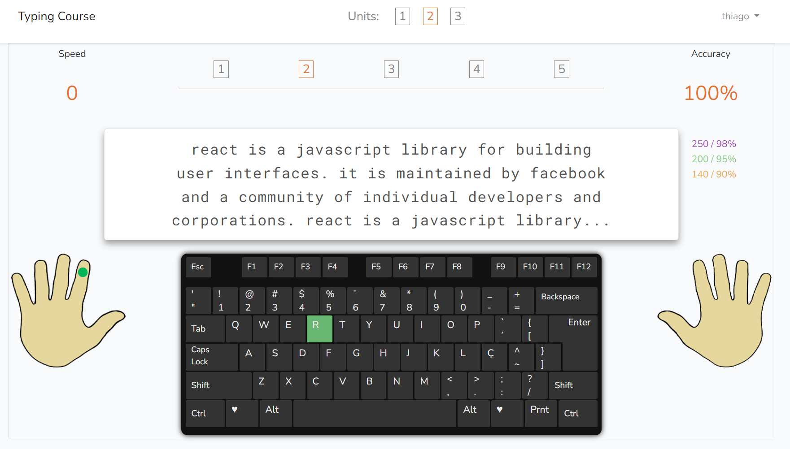

# Typing Course

タッチタイピングを練習できる Web アプリです。<br>
A web app to practice touch typing.

**https://digitacao.thiagotanaka.dev/**

[日本語](#日本語) · [English](#english)



## 日本語

### 概要

- 3 つのユニットに各 5 レッスン。ホームポジションから単語・文章まで段階的に練習できます。
- 入力速度（1 分あたりの正しい文字数）と正確さを表示します。
- ユーザー登録（メール認証あり）をすると、レッスンごとのスコアが保存されます。
- 管理者は画面からレッスンの文章を編集できます。

### Laravel 8 → 13 へのバージョンアップ

2021 年に Laravel 8 で作ったアプリを、Laravel 13 まで段階的にアップグレードしました。

| | 移行前 | 移行後 |
|---|---|---|
| PHP | 8.2 | 8.4（8.3 以上） |
| Laravel | 8.83 | 13.31 |
| PHPUnit | 9（サンプルテストのみ） | 12（テスト 29 件） |
| 既知の脆弱性（`composer audit`） | あり | なし |

**進め方**

1. **現在の動作を先にテストで固定** — アップグレード前の Laravel 8 上で、レッスン画面、スコア保存のルール、ユーザー登録とメール認証、管理画面の動作を確認する特性テスト（characterization test）を書きました。
2. **1 バージョンずつ更新** — 8 → 9 → 10 → 11 → 12 → 13 を 1 ステップ 1 コミットにして、毎回すべてのテストが通ることを確認しました。
3. **公式アップグレードガイドを項目ごとに確認** — 対応した変更と、このアプリに該当しなかった項目を各コミットメッセージに記録しています。
4. **既存の構成を維持** — ガイドの推奨どおり、Laravel 11 以降の新しいディレクトリ構成には移行せず、HTTP カーネルやサービスプロバイダーはそのままにしています。
5. **実際のブラウザで確認** — Laravel 13 の新しい CSRF 保護（`PreventRequestForgery`）が関わるログイン、スコア保存、管理画面での保存、ログアウトをブラウザで確認しました。

途中で見つかった問題は、アップグレードとは別のコミットで修正しています。例: Symfony Mailer への移行後、`MAIL_FROM_ADDRESS` が未設定だとユーザー登録時のメール送信が 500 エラーになる問題。

| コミット | 内容 |
|---|---|
| [`83b6d7d`](https://github.com/thiago-tanaka/typing/commit/83b6d7d) | 特性テスト（アップグレード前） |
| [`a3e53f9`](https://github.com/thiago-tanaka/typing/commit/a3e53f9) | Laravel 9（SwiftMailer → Symfony Mailer、TrustProxies と CORS をフレームワーク標準に） |
| [`569c900`](https://github.com/thiago-tanaka/typing/commit/569c900) | Laravel 10（PHPUnit 10） |
| [`10824ba`](https://github.com/thiago-tanaka/typing/commit/10824ba) | Laravel 11（PHPUnit 11、既存の構成を維持） |
| [`666868b`](https://github.com/thiago-tanaka/typing/commit/666868b) | Laravel 12 |
| [`21d9702`](https://github.com/thiago-tanaka/typing/commit/21d9702) | Laravel 13（PHP 8.3 以上、CSRF ミドルウェアの新しい名前） |

### ローカル環境での実行

必要なもの: PHP 8.3 以上（`pdo_sqlite` 拡張）、Composer

```bash
git clone https://github.com/thiago-tanaka/typing.git
cd typing
composer install
cp .env.example .env
php artisan key:generate
touch database/database.sqlite
php artisan migrate --seed
php artisan serve
```

- `.env.example` は SQLite を使う設定で、メールは送信せずにログ（`storage/logs/laravel.log`）に出力します。
- シーダーでレッスンと管理者ユーザーが作成されます（`database/seeders/DatabaseSeeder.php`）。
- テストの実行: `php artisan test`
- `docker/` はアップグレード前の開発環境で、現在は更新していません。

## English

### About

- 3 units with 5 lessons each, from the home row to words and sentences.
- Shows typing speed (correct characters per minute) and accuracy.
- Registered users (with email verification) get their score saved for each lesson.
- Admins can edit the lesson texts from the browser.

### Upgrading from Laravel 8 to 13

The app was built with Laravel 8 in 2021 and upgraded step by step to Laravel 13.

| | Before | After |
|---|---|---|
| PHP | 8.2 | 8.4 (8.3+) |
| Laravel | 8.83 | 13.31 |
| PHPUnit | 9 (example tests only) | 12 (29 tests) |
| Known vulnerabilities (`composer audit`) | yes | none |

**How it was done**

1. **Lock in the current behavior first.** Before touching the framework, characterization tests were written on Laravel 8 for the lesson pages, the score saving rules, registration with email verification, and the admin area.
2. **One version at a time.** Each step (8 → 9 → 10 → 11 → 12 → 13) is a single commit, and all tests pass after every step.
3. **Follow the official upgrade guides item by item.** Each commit message lists what changed and which items did not apply to this app.
4. **Keep the existing structure.** As the guide recommends, the app keeps its HTTP kernel and service providers instead of moving to the slim application structure of Laravel 11.
5. **Check in a real browser.** Login, saving a score, saving from the admin page and logout were tested with the new request forgery protection of Laravel 13 (`PreventRequestForgery`).

Problems found along the way were fixed in separate commits, for example registration failing with a 500 error after the move to Symfony Mailer when `MAIL_FROM_ADDRESS` is not set.

| Commit | Change |
|---|---|
| [`83b6d7d`](https://github.com/thiago-tanaka/typing/commit/83b6d7d) | Characterization tests (before the upgrade) |
| [`a3e53f9`](https://github.com/thiago-tanaka/typing/commit/a3e53f9) | Laravel 9 (SwiftMailer → Symfony Mailer, TrustProxies and CORS from the framework) |
| [`569c900`](https://github.com/thiago-tanaka/typing/commit/569c900) | Laravel 10 (PHPUnit 10) |
| [`10824ba`](https://github.com/thiago-tanaka/typing/commit/10824ba) | Laravel 11 (PHPUnit 11, existing structure kept) |
| [`666868b`](https://github.com/thiago-tanaka/typing/commit/666868b) | Laravel 12 |
| [`21d9702`](https://github.com/thiago-tanaka/typing/commit/21d9702) | Laravel 13 (PHP 8.3+, new name of the CSRF middleware) |

### Running locally

Requirements: PHP 8.3+ with the `pdo_sqlite` extension, Composer

```bash
git clone https://github.com/thiago-tanaka/typing.git
cd typing
composer install
cp .env.example .env
php artisan key:generate
touch database/database.sqlite
php artisan migrate --seed
php artisan serve
```

- `.env.example` uses SQLite, and emails are written to `storage/logs/laravel.log` instead of being sent.
- The seeders create the lessons and an admin user (`database/seeders/DatabaseSeeder.php`).
- Run the tests with `php artisan test`.
- The `docker/` folder is the original development setup and is no longer maintained.
